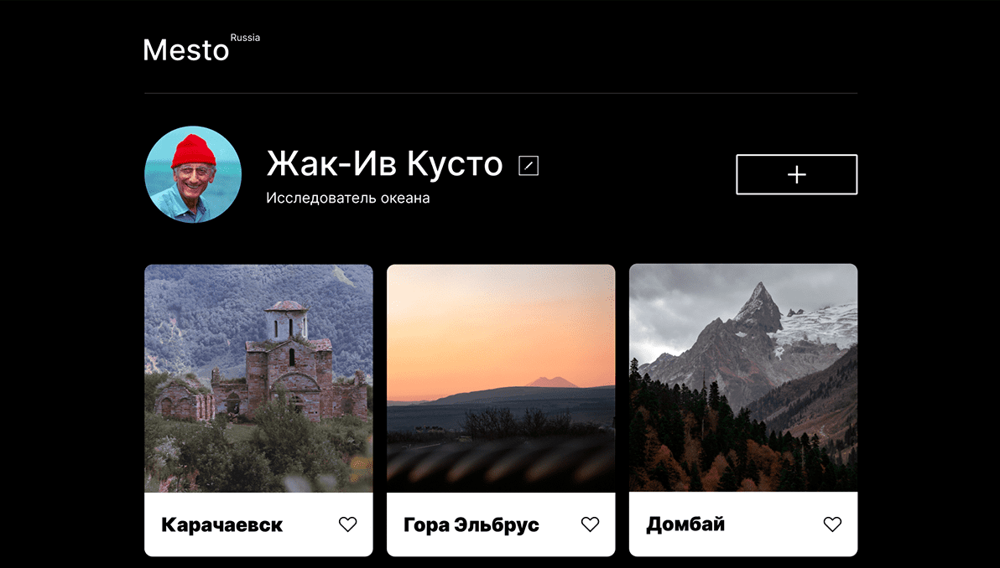
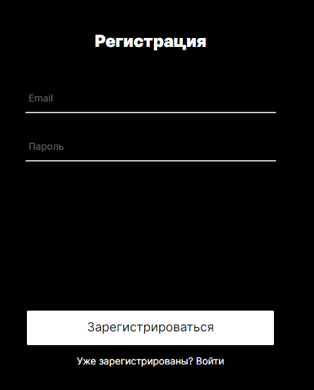
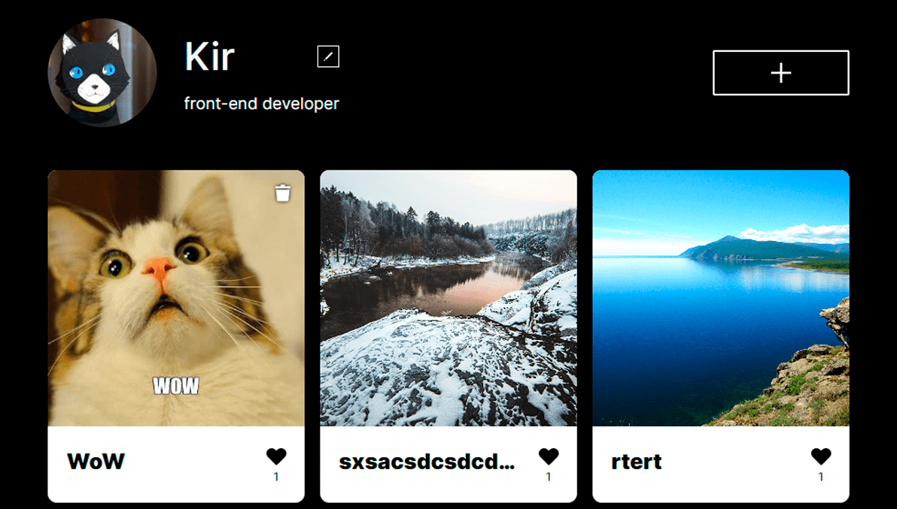
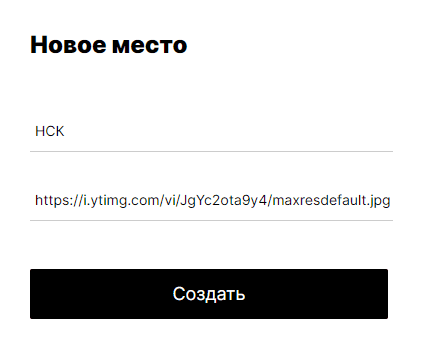

# Проект: Место на React. Домашняя работа на Яндекс.Практикум

## Введение

Данный сайт сервисом для обмена фотографиями. Основан на React.js.
За основу был взят макет [Figma](https://www.figma.com/file/2cn9N9jSkmxD84oJik7xL7/JavaScript.-Sprint-4?node-id=0%3A1).
Сайт адаптирован под ПК и мобильные устройства.

На странице релизованны:
1. Регистрация и авторизация пользователя.
2. Добавление/удаление (только своих) фотокарточек.
3. Лайк фотокарточек.
3. Адаптивная верстка.
4. Смена имени и аватара.
5. Popup окна на JS
6. Валидация форм

## Ссылка на проект

   [Страница Mesto Project](https://kiars1.github.io/react-mesto-auth)
   
   

## Демонстрация

  При первом запуске сайта вас будет ждать окно регистрации.

  > 

  После регистрации вы получаете доступ к сайту где можете взаимодействовать с его элементами.
  > 

  Добавление картинок возможно только в форме ссылки.

  > 

  Ни о какой защищенности и супер функционале речи не идет. Цель данной работы была научиться работать с React и взаимодействовать в back-end сервером хоть и в такой своеобразной форме.